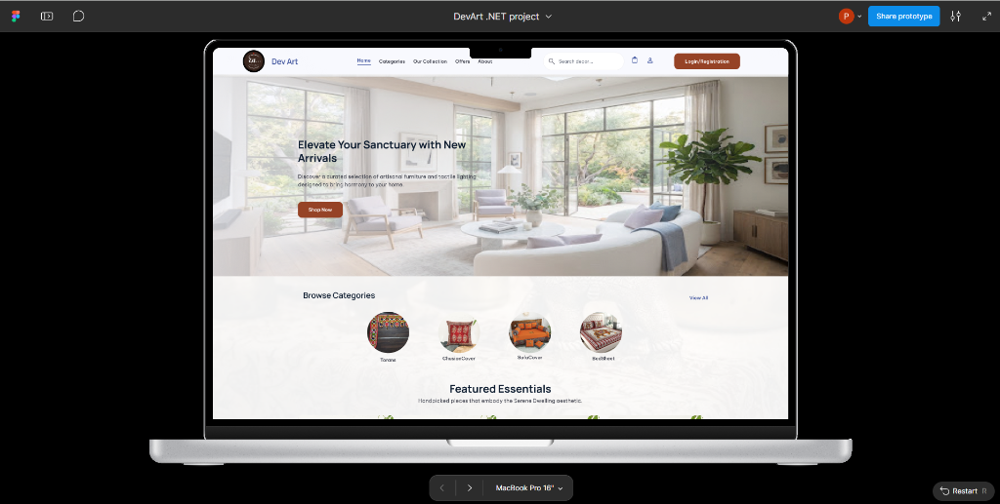
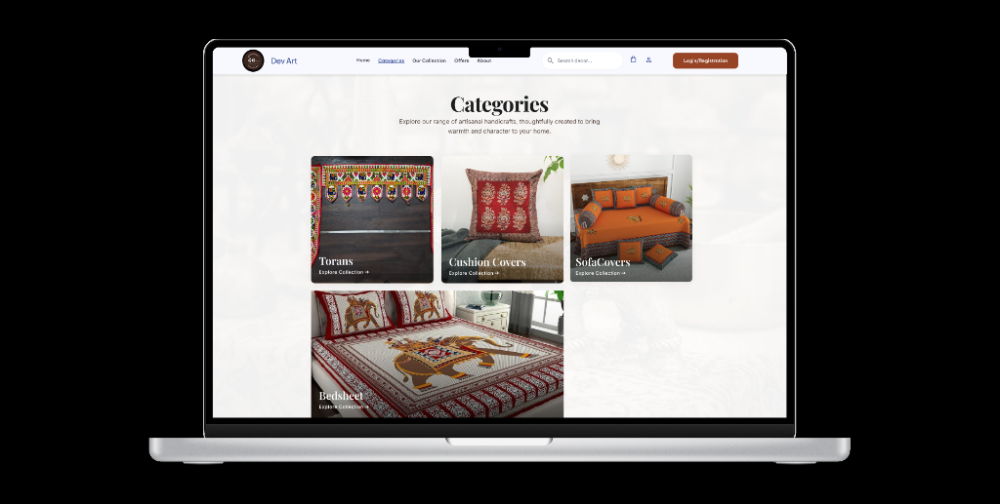
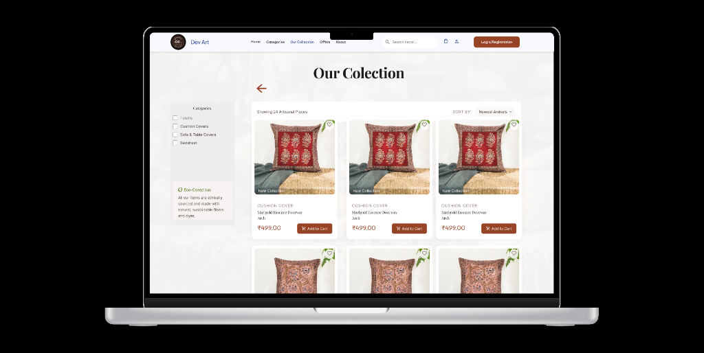
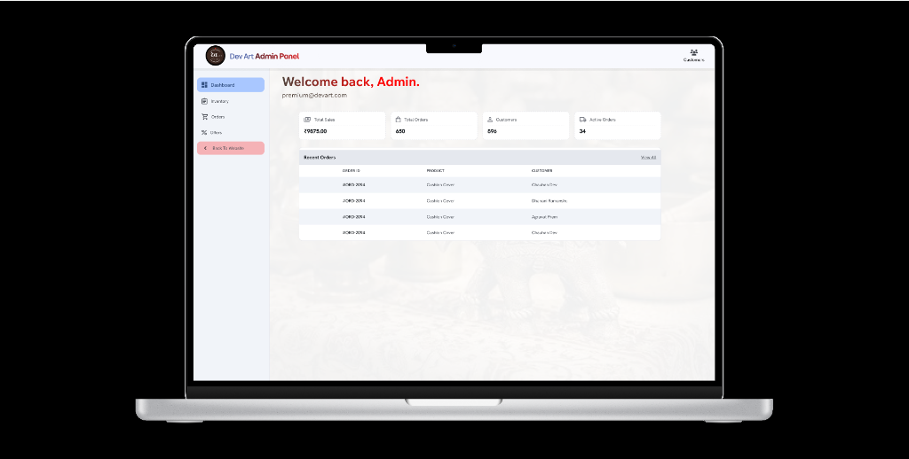

# 🎨 DevArt .NET — UI Design & Application Showcase

DevArt is a premium, modern handicraft e-commerce website designed to provide a seamless shopping experience for unique handmade goods. 

The design phase of this project is now **fully completed**. High-fidelity UI/UX specifications have been developed in Figma, covering both the **User (Customer) Section** and the **Store Admin Section**, with all essential features implemented to guide the upcoming **.NET implementation**.

---

## 🔗 Figma Prototype & Design Link

Explore the complete interactive design prototype for both the User and Admin sections:

* **⚡ Live Interactive Prototype**: [Launch Figma Prototype](https://www.figma.com/proto/m7cDokzMiorS3tfrNO6bFe/DevArt-.NET-project?node-id=53-2&p=f&t=OUpyDVe3yAo1aCtE-0&scaling=scale-down&content-scaling=fixed&page-id=0%3A1&starting-point-node-id=2%3A478&show-proto-sidebar=1)

---

## 📂 Repository Structure

```text
├── figma/
│   ├── design_link.md        # Interactive Figma prototype link
│   └── assets/               # Exported high-fidelity UI screenshots
│       ├── homepage.png
│       ├── categories.png
│       ├── collection.png
│       ├── offers.png
│       └── admin_dashboard.png
├── README.md                 # Project documentation and specifications
└── .gitignore                # Standard .NET gitignore file
```

---

## 🖼️ Completed UI Showcase

Below are the actual high-fidelity website designs for both the customer-facing storefront and the store admin dashboard:

### 🏠 1. Homepage
A visually rich and tactile landing page with a hero banner featuring artisanal goods, a categories navigator, and featured items.



---

### 📂 2. Categories
An organized category showcase designed to help users browse specific crafts such as Torans, Cushion Covers, Sofa Covers, and Bedsheets.



---

### 🛍️ 3. Our Collection (Catalog)
A comprehensive product catalog grid complete with filters (by categories like Torans, Cushion Covers, Bedsheet) and price tags.



---

### 🎟️ 4. Offers & Wishlist
A dedicated interface displaying available discount coupons (e.g., Free Shipping, Welcome Gift) and user rewards alongside redemption guides.


---

### 💼 5. Store Admin Panel
A clean administrative interface featuring real-time overview metrics (Total Sales, Total Orders, Customers, Active Orders) and a recent orders log.



---

## 🗺️ Completed Design Architecture

The DevArt website design covers all essential e-commerce workflows:

### 🛍️ User (Customer) Flow
* **Authentication**: Responsive signup and login forms.
* **Homepage**: Hero banners, category quick-links, and search bar.
* **Catalog & Filtering**: Checkbox filters, product grids, and sorting.
* **Detail & Purchase**: Detailed product pages with descriptions, prices, and checkout actions.
* **Offers & Coupons**: Code listings with interactive discount codes.

### 💼 Store Admin Flow
* **Dashboard Analytics**: Real-time sales trackers, customer counts, and overview tables.
* **Inventory CRUD**: Management interface to view active stock, update prices, and edit products.
* **Orders Fulfillment**: Admin tables to monitor order IDs, product details, and customer names.

---

## 🎨 Design Highlights & Visual Identity

The website follows a premium visual language based on **Tactile Minimalism** and **Organic Aesthetics**:

* **Earthy Color Palette**:
  - **Primary Earthy Brown**: `#8B5E3C` (Primary CTA buttons, navigation highlights, brand focus)
  - **Secondary Soft Blue**: `#A9C7EB` (Tags, badges, interactive states)
  - **Clean Background**: `#F8F9FA` (Soft off-white canvas for products)
* **Modern Typography**:
  - **Headings**: `DM Sans` (Clean, geometric, bold headlines)
  - **Body Text**: `Work Sans` (Highly legible, crisp body layout)
* **Shapes & Visual Depth**:
  - Spacious layouts with clean 8px baseline margins.
  - Tactile elements featuring soft 12px–20px corner radiuses and subtle drop shadows.

---

## 🛠️ Planned Development Stack

The completed designs serve as the blueprint for the web application's development phase:
- **Web Frontend / Backend**: ASP.NET Core (MVC, Razor Pages, or Blazor Server/WebAssembly)
- **Database / ORM**: Entity Framework Core & SQL Server
- **Authentication**: ASP.NET Core Identity (with cookie or token-based authorization)

---

## 🎯 Project Status

All core modules have been fully designed, marking the UI/UX stage complete.

| Module / Screen | Section | Design Status | Development Status |
|:---|:---:|:---:|:---:|
| **UI/UX Design Phase** | Overall | ✅ Completed | - |
| **Authentication System** | User | ✅ Completed | 🚧 Planned |
| **Homepage & Search** | User | ✅ Completed | 🚧 Planned |
| **Product Listings & Details** | User | ✅ Completed | 🚧 Planned |
| **Wishlist & Cart Management** | User | ✅ Completed | 🚧 Planned |
| **Checkout & Order Success** | User | ✅ Completed | 🚧 Planned |
| **User Profile & Orders List** | User | ✅ Completed | 🚧 Planned |
| **Admin Dashboard Analytics** | Admin | ✅ Completed | 🚧 Planned |
| **Inventory & Product CRUD** | Admin | ✅ Completed | 🚧 Planned |
| **Admin Order Management** | Admin | ✅ Completed | 🚧 Planned |
| **.NET Application Setup** | Infrastructure | - | 🚧 Planned |

---

## ⭐ Support

If you like this project, consider giving it a **Star ⭐** on GitHub! It helps support the project and motivates future development.

---

## 🏗️ Implementation Status (CE545)

The Figma design (`DevArt .NET project.pdf`, 48 frames) is now implemented as an
ASP.NET Web Forms application. Every frame in the prototype has a page behind it.

### Customer storefront

| Figma frame | Page | Notes |
| --- | --- | --- |
| 9 Home | `Default.aspx` | Hero, category strip, featured items, newsletter |
| 10 Categories | `Categories.aspx` | Tiles built by LINQ grouping over the product list |
| 11 Our Collection | `Collection.aspx` | Category filter, sort, add-to-cart, wishlist |
| 19 Item Detail | `ProductDetail.aspx` | Gallery, trust badges, reviews, write-a-review form |
| 12 Cart | `Cart.aspx` | Line quantities, promo code, live totals |
| 13 Shipping | `Shipping.aspx` | Address picker, order summary |
| 6 Add New Address | `Address.aspx` | Full contact + address form |
| 15 Payment | `Payment.aspx` | COD / UPI, places the order |
| 16 Order Successful | `OrderSuccess.aspx` | Order number, ETA, receipt |
| 14 + 8 Offers | `Offers.aspx` | Offer cards, copy code, how-to-redeem |
| 17 + 18 + 20 Profile | `Profile.aspx` | Details, stats, recent orders, change password |
| 21 My Orders | `MyOrders.aspx` | History with status filter |
| 22 Wishlist | `Wishlist.aspx` | Saved pieces, move to cart |
| 7 Help & Support | `Contact.aspx` | Contact cards + validated enquiry form |
| 23 About | `About.aspx` | Rajkot story, craft pillars, sustainability |
| 1 Login | `Login.aspx` | Email, password, remember me, forgot password, Admin Panel link |
| 2 Register | `Register.aspx` | Name, email, password, confirm, terms |
| 3 Forgot Password | `ForgotPassword.aspx` | Sends a 4-digit OTP |
| 4 Verify OTP | `VerifyOtp.aspx` | 4-digit code, 10-minute expiry, resend |
| 5 Change Password | `ResetPassword.aspx` | New password + confirm |

### Admin panel (`/Admin`)

| Figma frame | Page | Notes |
| --- | --- | --- |
| 1 "Admin Panel" link | `Admin/Login.aspx` | Staff sign-in, `@devart.com` addresses only |
| 27 Dashboard | `Admin/Dashboard.aspx` | Sales, order and customer tiles, recent orders, low stock |
| 28 Inventory | `Admin/Inventory.aspx` | Category chips, stock pills, edit / delete |
| 29 + 37 + 36 Product | `Admin/ProductEdit.aspx` | Add, edit and delete in one page |
| 31 Orders | `Admin/Orders.aspx` | Status filter, advance an order through fulfilment |
| 32 + 39 Offers | `Admin/Offers.aspx` | Offer cards with edit / delete |
| 41 + 42 + 46 Offer | `Admin/OfferEdit.aspx` | Add / edit / delete, discount type switches the fields |
| 33 + 34 + 35 Customers | `Admin/Customers.aspx` | Search, order counts, delete |

### Two master pages (Syllabus Unit 6)

`Site.Master` carries the storefront header, nav, live cart/wishlist badges and
footer; `Admin/Admin.Master` carries the dark admin chrome and puts every admin
page behind the staff sign-in. No page repeats that markup any more.

---

## ✅ ASP.NET Validation Layer (CE545)

Every form is guarded by ASP.NET **Validation Controls** (Syllabus Section II,
Unit 6 – *Designing Web Application → Validation Controls*). Each rule runs twice:
once in the browser for instant feedback and again on the server inside the button
handler, so a post-back that skips JavaScript is rejected identically.

### Where the validators live

| Page | Validation group(s) | Rules enforced |
| --- | --- | --- |
| `Default.aspx` | `Newsletter` | Email required, format, duplicate subscriber (Application state) |
| `Login.aspx` | `SignIn` | Email format, password required, credential check |
| `Register.aspx` | `Register` | Name pattern, email format, duplicate account, password strength, confirmation match, terms accepted |
| `ForgotPassword.aspx` | `Forgot` | Email format plus "this account exists" |
| `VerifyOtp.aspx` | `Otp` | Exactly 4 digits, matches the issued code, inside its 10-minute window |
| `ResetPassword.aspx` | `Reset` | Strength, confirmation match, not the current password |
| `Profile.aspx` | `Profile`, `Password` | Profile fields, plus an independent change-password block that proves group isolation |
| `ProductDetail.aspx` | `Buy`, `Review` | Quantity 1–10 and not over stock; reviewer name, 1–5 rating, headline, 5-word minimum |
| `Cart.aspx` | `Cart`, `Promo` | Per-line quantity 1–10; promo format, existence, expiry and minimum spend |
| `Shipping.aspx` | `Ship` | A delivery address must be selected |
| `Address.aspx` | `Address` | Name, phone, address line length, pincode, city, state, save-as label |
| `Payment.aspx` | `Pay` | Payment method; UPI ID required and pattern-checked **only** when UPI is chosen |
| `Contact.aspx` | `Contact` | Name, email, mobile, subject, 1–5 rating, call-back not in the past, 10-word message |
| `Admin/Login.aspx` | `AdminLogin` | `@devart.com` address, staff credential check |
| `Admin/ProductEdit.aspx` | `Product` | Unique name, category, currency range, stock range, image, 10-word description |
| `Admin/OfferEdit.aspx` | `Offer` | Unique promo code, type-specific amount fields, min spend, future expiry, flat-discount sanity check |

### Validator types demonstrated

| Control | Example |
| --- | --- |
| `RequiredFieldValidator` | Every mandatory field; `InitialValue=""` makes a drop-down or radio placeholder count as empty |
| `RegularExpressionValidator` | Email, Indian mobile (`^[6-9]\d{9}$`), 6-digit pincode, name, promo code, UPI ID, `@devart.com` staff address, 4-digit OTP |
| `CompareValidator` | Password ↔ Confirm Password (`Operator="Equal"`), date-of-birth `DataTypeCheck`, call-back date `GreaterThanEqual` today, offer expiry `GreaterThan` today |
| `RangeValidator` | Rating 1–5, quantity 1–10, stock 0–9999 (`Type="Integer"`), price and min-spend (`Type="Currency"`), date-of-birth 18–100 years (`Type="Date"`, bounds set in `Page_Load`) |
| `CustomValidator` | Password strength (client JS **and** `ValidationRules.IsStrongPassword`), terms checkbox (`ValidateEmptyText="true"`), duplicate email / product name / promo code, wrong credentials, OTP match and expiry, word counts, stock ceiling, flat discount vs minimum spend |
| `ValidationSummary` | One per group, rendered as a bulleted panel above the form |
| Conditional validators | `Payment.aspx` and `Admin/OfferEdit.aspx` enable and disable validators in code so hidden fields never block a post-back |

`Web.config` sets `ValidationSettings:UnobtrusiveValidationMode = None` so the
classic validation script is emitted without needing a jQuery `ScriptResourceMapping`.

---

## 🧱 Model layer (`Models/`)

| File | Purpose | Syllabus link |
| --- | --- | --- |
| `Person.cs` | `abstract` base with an abstract `Role` and a `virtual GetDisplayName()` | Unit 2 – inheritance, abstraction, encapsulation |
| `UserAccount.cs` | `UserAccount : Person` and `sealed class Enquiry : Person`, both overriding the base members | Unit 2 – overriding, `sealed` |
| `Catalog.cs` | `abstract CatalogItem` → `Product`; `abstract Offer` → `PercentageOffer` / `FlatOffer` / `FreeShippingOffer`, each computing its own discount | Unit 2 – **polymorphism**: the cart total calls `CalculateDiscount` without knowing the offer type |
| `CartItem.cs`, `CartService.cs` | The Session-backed cart and wishlist, in one place | Unit 8 – state management |
| `AppData.cs` | Store built on `List<T>` and `Dictionary<K,V>`, queried with LINQ, with full CRUD for users, products, offers, orders and addresses | Unit 3 – LINQ, Unit 4 – generic collections |
| `ValidationRules.cs` | Single source of truth for the regex patterns and the password rule shared by client and server | Unit 6 – validation |

> The data layer is deliberately in-memory. `AppData` is the only class that touches
> data, so swapping it for ADO.NET (`SqlConnection` / `SqlDataAdapter` CRUD, Unit 7)
> does not require editing a single page or validator.

---

## 🔁 State management used (Unit 8)

* **ViewState** – per-page control state across post-backs.
* **Session** – signed-in `UserAccount`, admin sign-in, cart, wishlist, promo code, chosen shipping address, OTP and its timestamp, one-shot flash messages.
* **Application** – newsletter subscribers, shared across all visitors, written under `Application.Lock()`.
* **QueryString** – `Collection.aspx?category=…&sort=…`, `ProductDetail.aspx?id=…`, `Login.aspx?returnUrl=…`, `Admin/ProductEdit.aspx?id=…`.

---

## 🔑 Demo credentials

| Role | Email | Password |
| --- | --- | --- |
| Customer | `parth@devart.in` | `Devart@123` |
| Store staff | `admin@devart.com` | `Admin@123` |

Promo codes: `ARTISAN20`, `WELCOME15`, `FREESHIP150`, `DEVART10`, `FESTIVE25`, `NEWHOME15`, `NEWARTISAN15`, `DEVARTLOYAL`.

---

## 📋 Rubric coverage (TSEE, 50 marks)

| Parameter | Where it is evidenced |
| --- | --- |
| Implementation of Layouts (20) | All 48 Figma frames implemented across 20 storefront and 8 admin pages, on two master pages |
| Database Connectivity (10) | `Models/AppData.cs` isolates all data access behind one class, ready for the ADO.NET swap |
| OOP Concepts & Collections (5) | `Person`/`CatalogItem`/`Offer` hierarchies with abstract, virtual, override and `sealed`; `List<T>`, `Dictionary<K,V>` and LINQ throughout |
| State Management (5) | ViewState, Session, Application and QueryString, listed above |
| Version Control (5) | Commit the design implementation as its own milestone |
| Voice-Viva (5) | Comments in each `.aspx` explain *why* each validator was chosen |
