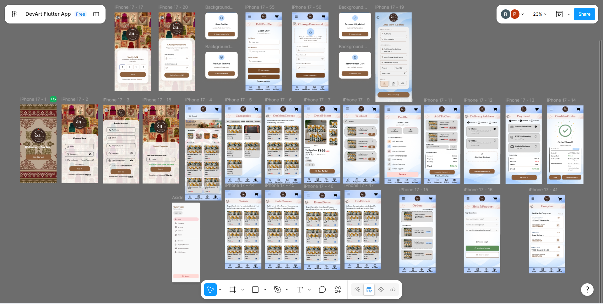
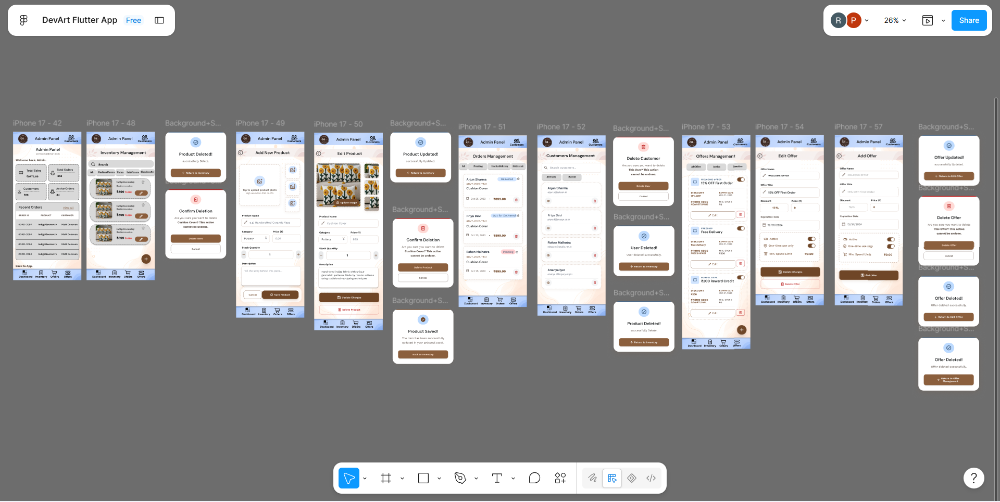
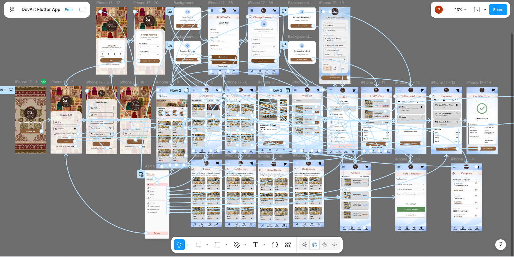
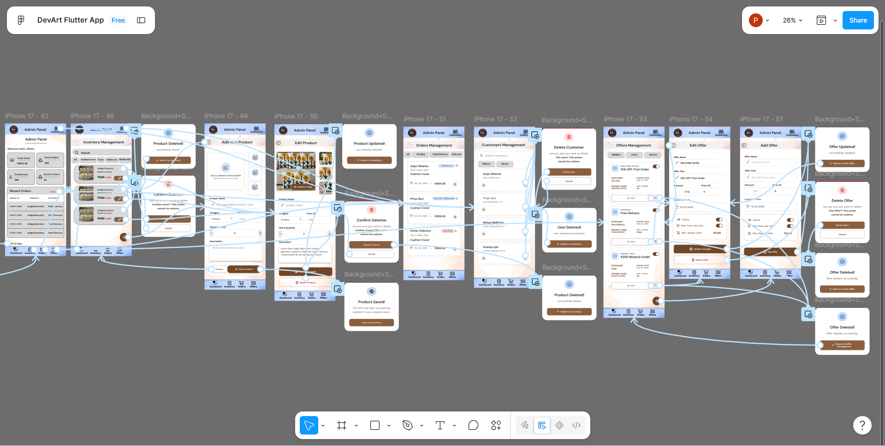

# 🎨 DevArt .NET — UI Design & Application Showcase

DevArt is a premium, modern handicraft shopping application focused on providing a tactile, organic, and minimalist ecommerce experience. 

The design phase of this project is now **fully completed**, showcasing high-fidelity UI/UX specifications in **Figma** for both the **Customer Shopping Experience** and the **Store Admin Panel**. Development is planned using the **.NET ecosystem** (such as ASP.NET Core, .NET MAUI, or Blazor).

---

## ✨ Design Completion Overview

We have built and finalized the designs for both sides of the application:

### 🛍️ User (Customer) Section
* **Authentication & Onboarding**: Clean, minimalist signup, login, and welcome flows.
* **Home Page**: A visually rich landing page with featured items, daily recommendations, and search.
* **Categories Page**: Visual category selectors for browsing specific craft groups.
* **Handicraft Items Listing**: Filterable product lists with clean grid layouts.
* **Product Details Page**: A tactile interface showcasing craft description, creator bio, ratings, and checkout triggers.
* **Wishlist**: A dedicated section to save favorite handicrafts.
* **Shopping Cart & Checkout**: A multi-step flow from basket review to shipping and payment configurations.
* **Order Success Screen**: A neat confirmation window.

### 💼 Admin Section
* **Analytics Dashboard**: Central control panel with widgets tracking total revenue, sales volume, and customer traffic.
* **Inventory Control & Management**: Real-time product inventory tables showing status tags, pricing, and stock levels.
* **Product Editing & Addition**: Detailed forms to update or create handicraft items, configure metadata, and manage image assets.

---

## 🔗 Figma Prototype & Design Links

Explore the complete interactive design prototype and inspect design specs below.

* **⚡ Live Interactive Prototype (Full App)**: [Launch Figma Prototype](https://www.figma.com/proto/S5bQWaqh9je6CCEzaqppYL/DevArt-Flutter-App?node-id=2-273&p=f&t=6NYSDUl090e1h4K4-0&scaling=scale-down&content-scaling=fixed&page-id=0%3A1&starting-point-node-id=2%3A273&device-frame=0)
* **🎨 Figma Design Workspace (Dev Mode)**: [Open Figma Design Link](https://www.figma.com/design/S5bQWaqh9je6CCEzaqppYL/DevArt-Flutter-App?node-id=0-1&m=dev&t=6NYSDUl090e1h4K4-1)

---

## 📂 Repository Structure

```text
├── figma/
│   ├── design_link.md        # Interactive Figma prototype & workspace links
│   ├── Home Page.png         # Exported homepage UI mockup
│   └── assets/               # Exported high-fidelity UI screens & flows
│       ├── customer_section.png
│       ├── customer_navigation.png
│       ├── admin_section.png
│       └── admin_navigation.png
│
├── README.md
└── .gitignore
```

---

## 🗺️ Design Architecture & Flow Layers

The application's design is structured into four interactive layers depicting the user layouts and control routes:

### 🛍️ Layer 1: Customer Section
The user interface details the clean customer shopping experience, including cart handling, account details, and active vouchers.



---

### 💼 Layer 2: Admin Section
The store owner interface provides centralized analytics, inventory lists, and tools to list new items.



---

### 🛣️ Layer 3: Customer Navigation Flow
This layout diagrams the interactive path and transition routes designed for the customer's shopping journey.



---

### ⚙️ Layer 4: Admin Navigation Flow
This diagrams the administrative routes connecting the dashboard, inventory management, and product editor.



---

# 🎨 Design Highlights & Visual Identity

DevArt follows a premium visual language combining **Tactile Minimalism** and **Soft Organicism**:

* **Earthy Color Palette**:
  - **Primary Earthy Brown**: `#8B5E3C` (Brand buttons, key highlights)
  - **Secondary Soft Blue**: `#A9C7EB` (Chips, status tags, soft highlights)
  - **Scaffold Background**: `#F8F9FA` (Off-white, premium, organic look)
* **Modern Typography**:
  - **Headings**: `DM Sans` (Geometric & bold)
  - **Body / UI Text**: `Work Sans` (Highly readable, neutral)
* **Spacing**: 8px baseline rhythm with 20px screen margins.
* **Shapes**: Soft, organic corner radiuses (12px–20px) on cards, inputs, and actions.

---

# 🚀 Planned Development

The UI designs will be implemented using Microsoft's .NET technologies to build a robust web application.

Proposed technology stack:
- **Backend / Frontend**: ASP.NET Core (MVC, Razor Pages, or Blazor)
- **Database**: Entity Framework Core & SQL Server
- **Authentication**: ASP.NET Core Identity / JWT

---

# 🎯 Project Status

| Module | Status |
|---------|--------|
| **UI/UX Design Phase** | ✅ **Completed** |
| **Customer/User Section** | ✅ **Completed** |
| **Store Admin Section** | ✅ **Completed** |
| **Interactive Flows & Navigation Maps** | ✅ **Completed** |
| **.NET Development** | 🚧 Planned (Implementation Phase) |

---

# 🌟 Future Roadmap

- [ ] User Authentication & Access Controls
- [ ] Database Schema & EF Core Integration
- [ ] Product Catalog & Advanced Search API
- [ ] Payment Gateway Integration (Stripe/PayPal)
- [ ] Admin Control Panels & Analytics Reporting
- [ ] Responsive Web Layout Deployment

---

## ⭐ Support

If you like this project, consider giving it a **Star ⭐** on GitHub! It helps support the project and motivates future development.
